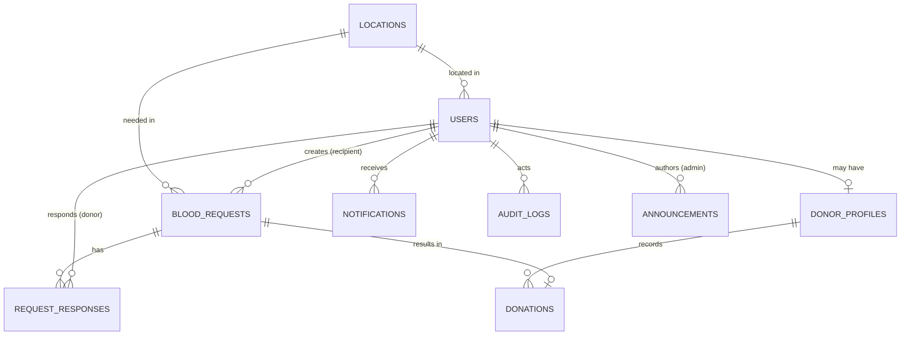

# Community Blood Bank Platform — Database Schema (MVP)

> Companion to the Core Feature Documentation and API Specification.
> Target engine: PostgreSQL (recommended) or MySQL. Types shown in generic SQL.
> Convention: `snake_case`, UUID or BIGINT primary keys, `created_at` / `updated_at` on every table.

---

## 1. Design Principles

1. **One account, extensible roles.** A single `users` table holds every account. A user's role is captured so that recipient/donor/admin capabilities can coexist on one account later without a schema change.
2. **Donor data is separate.** Donor-specific fields live in `donor_profiles`, created only when a user registers as a donor. This keeps `users` lean and mirrors the "register as donor" step.
3. **Location is normalized.** A small `locations` table represents unions/villages within the thana, so search and reporting stay consistent.
4. **The request is the spine.** `blood_requests` drives the lifecycle; `request_responses` records each donor's accept/decline; `donations` records completed events and feeds eligibility.
5. **Everything sensitive is auditable.** `audit_logs` captures admin state changes.

## 2. Entity Relationship Diagram

## 3. Enumerations

| Enum | Values |
|------|--------|
| `role` | `recipient`, `donor`, `admin` |
| `blood_group` | `A+`, `A-`, `B+`, `B-`, `AB+`, `AB-`, `O+`, `O-` |
| `user_status` | `active`, `pending_verification`, `suspended`, `deleted` |
| `donor_verification` | `unverified`, `verified`, `rejected` |
| `request_urgency` | `routine`, `urgent`, `emergency` |
| `request_status` | `draft`, `pending_review`, `published`, `matched`, `in_progress`, `fulfilled`, `cancelled`, `expired`, `unfulfilled` |
| `response_status` | `accepted`, `declined`, `withdrawn` |
| `notification_type` | `new_request`, `status_update`, `donor_response`, `announcement` |

## 4. Tables

### 4.1 `users`
| Column | Type | Notes |
|--------|------|-------|
| id | UUID (PK) | |
| full_name | VARCHAR(120) | |
| phone | VARCHAR(20) | Unique; primary identity |
| email | VARCHAR(160) | Nullable, unique if present |
| password_hash | VARCHAR(255) | |
| role | ENUM(role) | Default `recipient` |
| blood_group | ENUM(blood_group) | Nullable for recipients |
| location_id | UUID (FK → locations.id) | Nullable |
| status | ENUM(user_status) | Default `pending_verification` |
| phone_verified | BOOLEAN | Default false |
| preferred_language | VARCHAR(5) | `bn` / `en` |
| created_at / updated_at | TIMESTAMP | |

### 4.2 `donor_profiles`
| Column | Type | Notes |
|--------|------|-------|
| id | UUID (PK) | |
| user_id | UUID (FK → users.id) | Unique (1:1) |
| blood_group | ENUM(blood_group) | Required for donors |
| is_available | BOOLEAN | Availability toggle; default true |
| verification | ENUM(donor_verification) | Default `unverified` |
| last_donation_date | DATE | Nullable |
| next_eligible_date | DATE | Computed from last donation + cooldown |
| total_donations | INT | Denormalized count; default 0 |
| notes | TEXT | Optional (e.g. medical remarks) |
| created_at / updated_at | TIMESTAMP | |

### 4.3 `locations`
| Column | Type | Notes |
|--------|------|-------|
| id | UUID (PK) | |
| name | VARCHAR(120) | Union / village name |
| type | VARCHAR(30) | `union`, `village`, `ward` |
| parent_id | UUID (FK → locations.id) | Nullable, self-reference for hierarchy |
| created_at / updated_at | TIMESTAMP | |

### 4.4 `blood_requests`
| Column | Type | Notes |
|--------|------|-------|
| id | UUID (PK) | |
| recipient_id | UUID (FK → users.id) | |
| patient_name | VARCHAR(120) | May differ from recipient |
| patient_age | INT | Nullable |
| blood_group | ENUM(blood_group) | Required group |
| units_needed | INT | Default 1 |
| units_fulfilled | INT | Default 0 (supports partial) |
| hospital_name | VARCHAR(160) | Where transfusion happens |
| location_id | UUID (FK → locations.id) | |
| urgency | ENUM(request_urgency) | |
| needed_by | TIMESTAMP | Deadline; drives expiry |
| status | ENUM(request_status) | Default `pending_review` |
| notes | TEXT | Optional |
| reviewed_by | UUID (FK → users.id) | Admin who published/rejected |
| created_at / updated_at | TIMESTAMP | |

### 4.5 `request_responses`
Records each donor's action on a request. Contact is only exposed via API once `accepted`.
| Column | Type | Notes |
|--------|------|-------|
| id | UUID (PK) | |
| request_id | UUID (FK → blood_requests.id) | |
| donor_id | UUID (FK → users.id) | |
| status | ENUM(response_status) | |
| responded_at | TIMESTAMP | |
| donor_confirmed_completion | BOOLEAN | Default false |
| created_at / updated_at | TIMESTAMP | Unique (request_id, donor_id) |

### 4.6 `donations`
Immutable record of a completed donation; source of truth for donation history and cooldown.
| Column | Type | Notes |
|--------|------|-------|
| id | UUID (PK) | |
| donor_profile_id | UUID (FK → donor_profiles.id) | |
| request_id | UUID (FK → blood_requests.id) | Nullable (allows off-platform log) |
| donation_date | DATE | |
| units | INT | Default 1 |
| recipient_confirmed | BOOLEAN | Mutual-confirmation flag |
| created_at | TIMESTAMP | |

### 4.7 `notifications`
| Column | Type | Notes |
|--------|------|-------|
| id | UUID (PK) | |
| user_id | UUID (FK → users.id) | Recipient of the notification |
| type | ENUM(notification_type) | |
| title | VARCHAR(160) | |
| body | TEXT | |
| reference_id | UUID | Nullable (e.g. request id) |
| is_read | BOOLEAN | Default false |
| channel | VARCHAR(20) | `in_app`, `sms` |
| created_at | TIMESTAMP | |

### 4.8 `announcements`
| Column | Type | Notes |
|--------|------|-------|
| id | UUID (PK) | |
| author_id | UUID (FK → users.id) | Admin |
| title | VARCHAR(160) | |
| body | TEXT | |
| is_published | BOOLEAN | Default true |
| created_at / updated_at | TIMESTAMP | |

### 4.9 `audit_logs`
| Column | Type | Notes |
|--------|------|-------|
| id | UUID (PK) | |
| actor_id | UUID (FK → users.id) | Usually admin |
| action | VARCHAR(80) | e.g. `request.publish` |
| entity_type | VARCHAR(40) | e.g. `blood_request` |
| entity_id | UUID | |
| metadata | JSONB | Before/after or context |
| created_at | TIMESTAMP | |

### 4.10 `auth_tokens` (optional, if not using stateless JWT only)
| Column | Type | Notes |
|--------|------|-------|
| id | UUID (PK) | |
| user_id | UUID (FK → users.id) | |
| token_hash | VARCHAR(255) | For refresh tokens / OTP / reset codes |
| purpose | VARCHAR(30) | `otp`, `password_reset`, `refresh` |
| expires_at | TIMESTAMP | |
| used_at | TIMESTAMP | Nullable |
| created_at | TIMESTAMP | |

## 5. Key Relationships Summary

- A **user** has at most one **donor_profile** (created on donor registration).
- A **user** (recipient) creates many **blood_requests**.
- A **blood_request** collects many **request_responses**, one per responding donor.
- A completed request produces one or more **donations**, which update the donor's `last_donation_date`, `next_eligible_date`, and `total_donations`.
- **locations** are referenced by both users and requests for search and reporting.

## 6. Indexing Recommendations (MVP)

- `users(phone)` unique; `users(blood_group, location_id)` for donor search.
- `donor_profiles(blood_group, is_available, verification)` — the hot search path.
- `blood_requests(status, blood_group, location_id)` — public board + matching.
- `blood_requests(needed_by)` — expiry sweep job.
- `request_responses(request_id)`, `request_responses(donor_id)`.
- `notifications(user_id, is_read)`.

## 7. Derived / Job-Maintained Values

- `next_eligible_date` = `last_donation_date` + configurable cooldown (system setting, default 90–120 days).
- `total_donations` incremented on each confirmed donation.
- `blood_requests.status` transitioned to `expired` by a scheduled job when `needed_by` passes without fulfillment.
